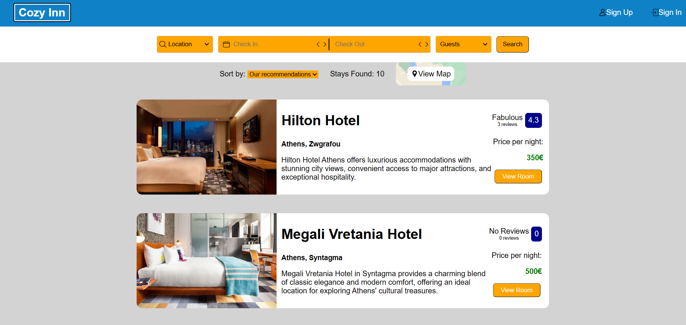
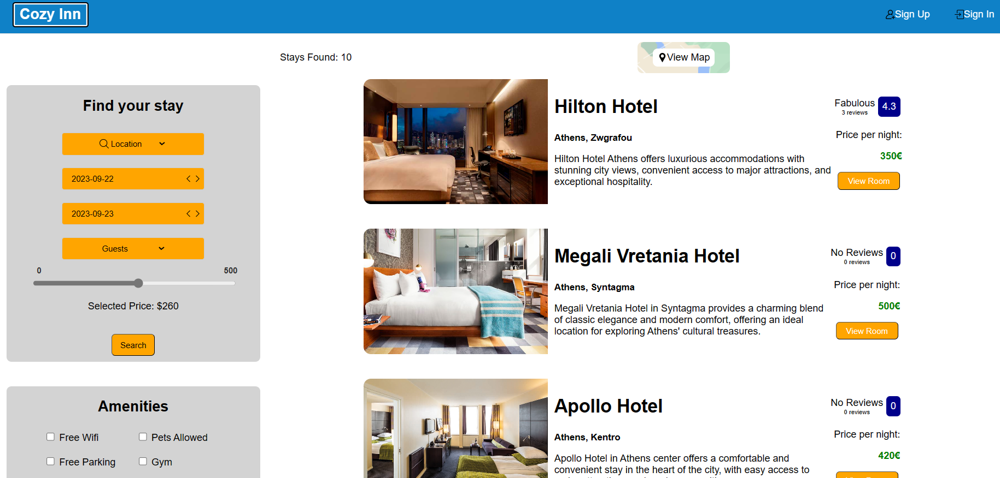
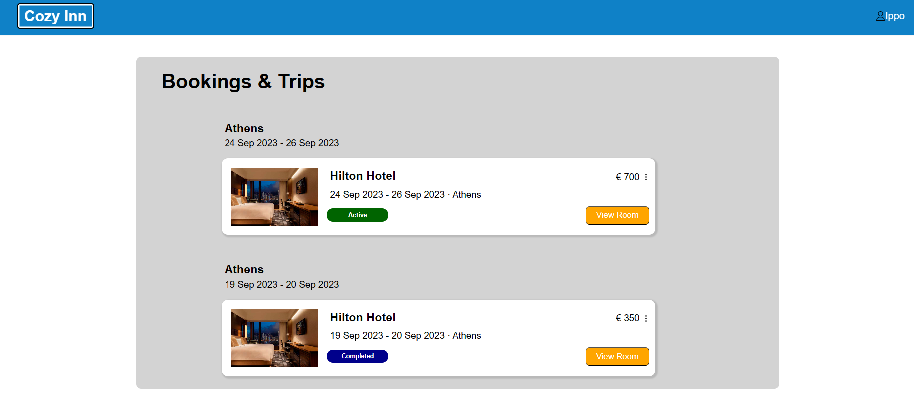
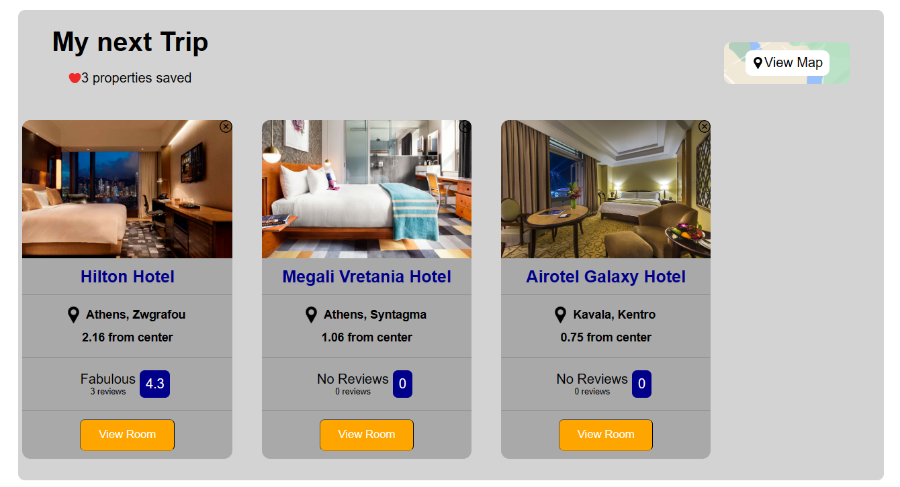
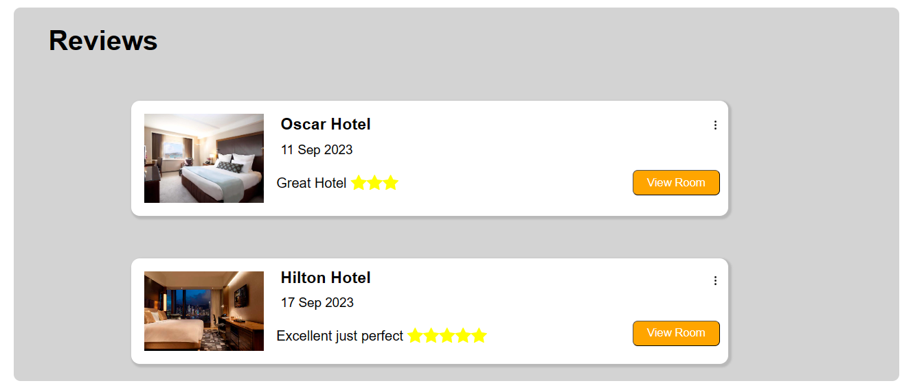
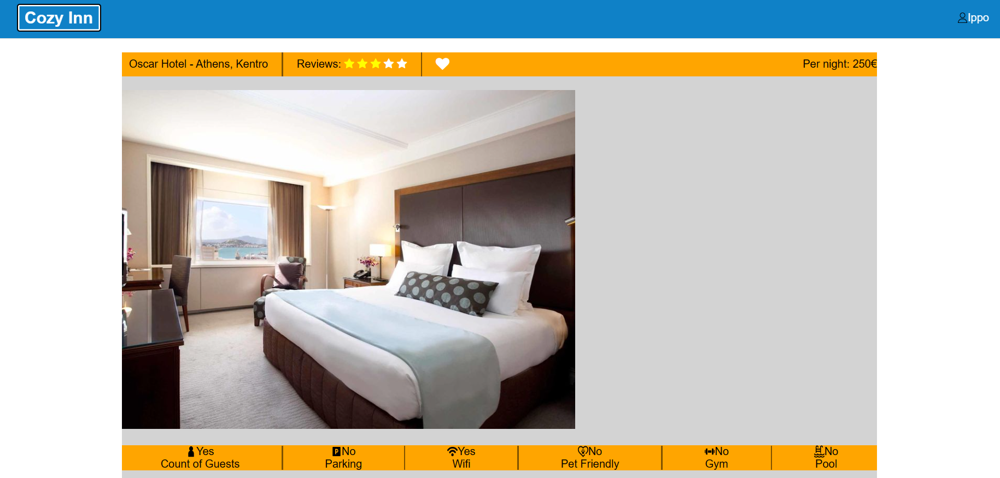
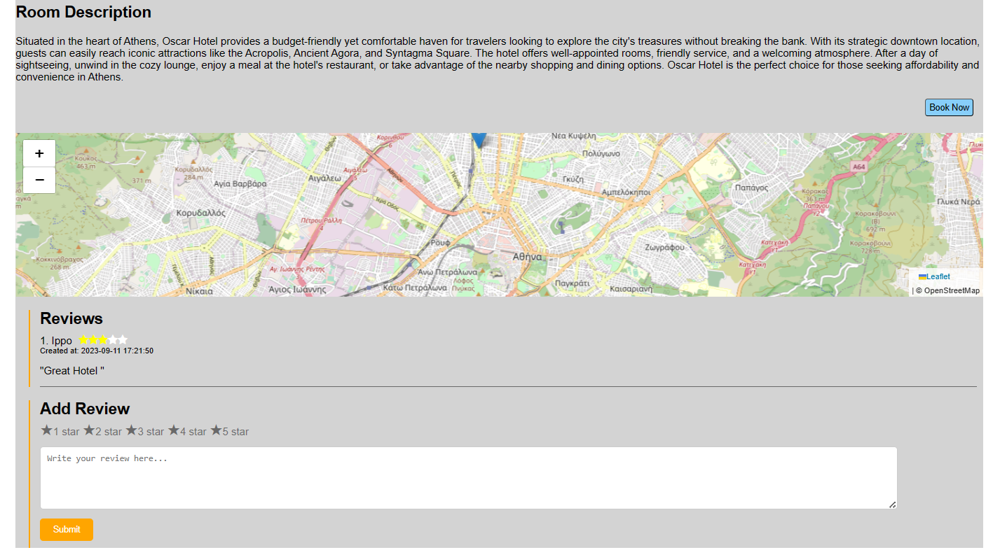
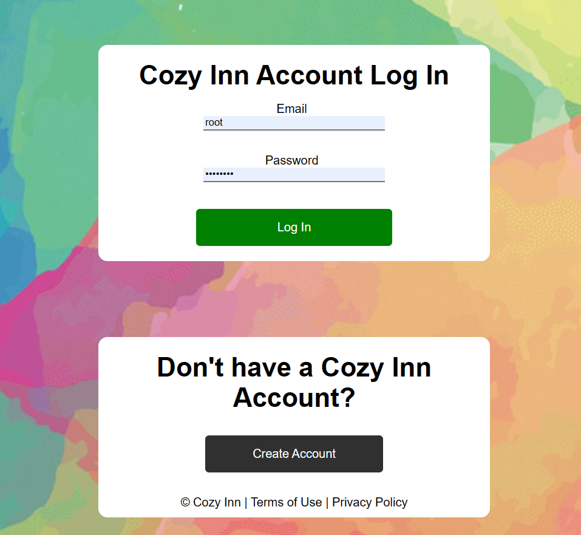

# Cozy Inn Hotel Booking Website

Cozy Inn's Hotel Booking Website is a fully functional web application that allows users to search, book, review, and save their favorite hotels. It's built using HTML, CSS, JavaScript for the frontend, and PHP for the backend, with a SQL database for data storage.

## Table of Contents

- [Features](#features)
- [Screenshots](#screenshots)
- [Getting Started](#getting-started)
  - [Installation](#installation)
- [Usage](#usage)
- [Database](#database)
- [Contributing](#contributing)
- [License](#license)

## Features

- User Registration: Users can create accounts with a username, email, and password.
- Hotel Search: Search for hotels based on location, check-in/out dates, and other preferences.
- Booking: Users can book hotels, specifying their check-in and check-out dates.
- Reviews: Users can leave reviews and ratings for hotels they've booked.
- Favorites: Users can mark hotels as favorites to easily access them later.

## Screenshots

### Home Page 🏠

Welcome to the Hotel Booking Website's Home Page! Our user-friendly interface provides you with a seamless experience to discover and book your ideal hotel stay. Here's what you can do on our main page:

- **Discover Recommended Hotels**: Upon landing on the Home Page, you'll find a curated list of recommended hotels to help you kickstart your journey. These hotels are carefully selected based on various factors to ensure a great experience.

- **Sort by Price and Rating**: Customize your search by sorting hotels based on your preferences. You can easily filter hotels by price to find options that match your budget or sort by rating to see the highest-rated accommodations.

- **Effortless Search**: Looking for something specific? Our search functionality allows you to quickly find hotels based on location, type of room, and other criteria. Simply enter your preferences, and we'll provide you with tailored results.



### Search Page 🔍

Welcome to the Search Page, your gateway to fine-tuning your hotel search to meet your exact preferences. Here's what you can do on this page:

- **Filter by Amenities**: Customize your hotel search by selecting specific amenities that matter most to you. Whether it's a pool, gym, or room service, we have you covered. Find the perfect accommodations that match your lifestyle.

- **Price Slider**: Use the handy price slider to set your budget range. Slide left for more affordable options or right for a touch of luxury. Our real-time results update as you adjust the slider, ensuring you stay within your desired price range.

- **Clear Filters and Start Over**: Don't quite find what you're looking for with your current search? No worries! A single click on the "Clear Filters" button, and you can start your search anew, free from any previously applied filters.

With our user-friendly search page, tailoring your hotel search has never been easier. Refine your choices, discover hidden gems, and make your next hotel booking a perfect match for your needs and preferences.



### Profile Page 🆔

Welcome to your Profile Page, your personalized hub for managing your hotel bookings and preferences. Here's what you can do on this page:

- **View Bookings**: Easily access information about your past and active hotel bookings. See details like check-in and check-out dates, room types, and reservation statuses.

- **Review Your Stays**: Share your experiences by viewing and managing your hotel reviews. You can leave feedback and ratings for hotels you've previously booked, helping fellow travelers make informed choices.

- **Favorite Rooms**: Explore a collection of your favorite rooms. Save and organize rooms that caught your eye for future reference. Found something even better? You can remove any room from your favorites that you no longer wish to keep.

Your Profile Page is your travel companion, helping you keep track of your hotel adventures and preferences. Enjoy a seamless experience as you manage your bookings and make your next travel plans with confidence!





### Room Page 🛏️

Welcome to the Room Page, your source for comprehensive details about our featured hotel rooms. Here's what you can explore on this page:

- **City Name**: Discover the enchanting city where this room is located. Immerse yourself in the local culture and attractions.

- **Room Description**: Get a closer look at the room through a detailed description. Find out about the amenities, decor, and unique features that make this room special.

- **Average Rating**: Read about the experiences of previous guests. The average rating provides valuable insights into the quality of this room.

- **Location on Map**: Explore the room's precise location on our interactive map. Get a feel for the surrounding area, nearby landmarks, and travel routes.

- **Reviews**: Dive into guest reviews to learn more about their stays. Gain firsthand knowledge from fellow travelers about their experiences in this room.

- **Actions After Signing In**:
  - **Book for Specific Dates**: Sign in to your account to book this room for your desired dates. Secure your reservation and look forward to a memorable stay.
  - **Add a Review**: Share your thoughts about your experience in this room by adding a review. Help others make informed decisions.
  - **Add to Favorites**: Save this room to your favorites list for easy access. You can revisit it later when planning your next trip.

The Room Page offers a comprehensive view of our exceptional accommodations. Explore every detail, make bookings, contribute your feedback, and plan your future stays with ease.




### Register Page 📝

Welcome to the Register Page, your gateway to creating a personalized account on our platform. Here's how you can get started:

- **Mandatory Information**: To create your account, please provide the following compulsory details:
  - First Name
  - Last Name
  - Username
  - Email
  - Password
  - Confirmed Password

- **Optional Fields**: We value your privacy and preferences. Feel free to provide additional information, such as your gender. It's entirely optional and helps us tailor your experience better.

- **Terms and Conditions**: Before proceeding, please review and accept our terms and conditions. We believe in transparency and ensuring that your data is handled with care.

- **Validator**: Our smart validator ensures that all mandatory fields are properly filled out before you can proceed. This helps prevent errors and ensures a smooth registration process.

Once you've completed these steps, click the "Create" button to establish your account. Welcome aboard! Enjoy the benefits of being a registered member of our community.


### Sign-In Page

### Sign-In Page

Welcome back! The Sign-In Page is where you can securely access your account. Here's how the process works:

- **Email and Password**: To log in, simply enter your registered email and password. Your password is securely hashed in our database, ensuring the confidentiality of your data.

- **Validation**: We'll validate the provided password against our database to ensure it matches your account's stored credentials.

- **Successful Login**: If everything checks out, you'll be securely connected to your account. Access your bookings, reviews, and favorite rooms effortlessly.

Your security is our priority. Rest assured that your login process is protected by robust encryption and authentication measures, providing a safe and convenient experience.




## Getting Started

### Installation

1. Clone the repository:

   ```bash
   git clone https://github.com/yourusername/hotel-booking-website.git
